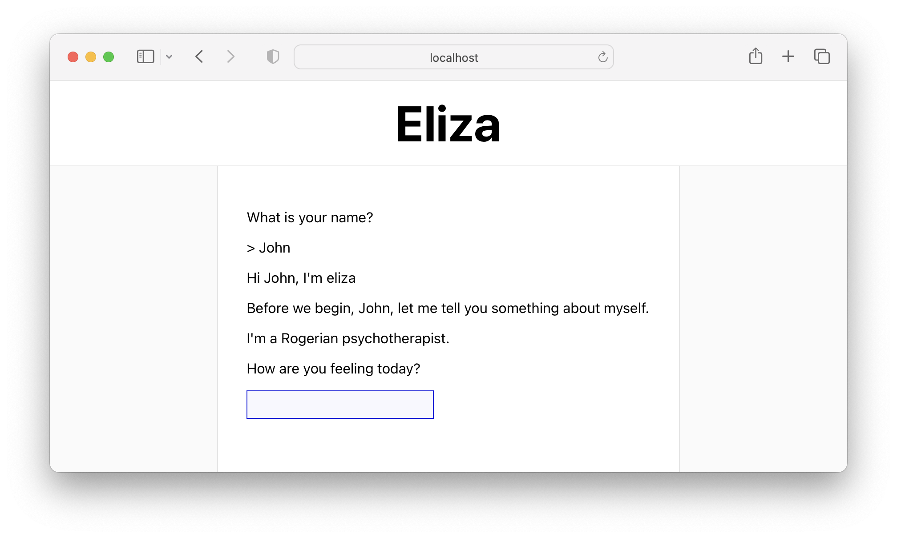

# Code example

This directory contains a simple example for running a Connect-Web client with a Connect-Node server using [Express](https://expressjs.com/).

The application is a web interface for a stripped-down version of [ELIZA](https://en.wikipedia.org/wiki/ELIZA), a very
simple natural language processor built in the 1960s to represent a psychotherapist. 

You can find the protocol buffer schema [on the BSR](https://buf.build/bufbuild/eliza/tree/main:buf/connect/demo/eliza/v1/eliza.proto).

## Run the example

You will need [Node 18](https://nodejs.org/en/download/) installed. Download the example project and install 
its dependencies:

```shell
curl -L https://github.com/bufbuild/connect-web/archive/refs/heads/main.zip > connect-web-main.zip
unzip connect-web-main.zip 'connect-web-main/packages/example/*'

cd connect-web-main/packages/example
npm install
```

Next, start the Connect-Node server:

```shell
npm start
```

That's it!  You should now be able to open a web browser to http://localhost:8080 and see the example running locally.




## Using Node.js as a client

The file `src/client.ts` implements a CLI client that you can run in Node.js. 

```shell
$ npm run client
```

```
What is your name?
> John
Hi John, I'm eliza
Before we begin, John, let me tell you something about myself.
I'm a Rogerian psychotherapist.
How are you feeling today?
> █
```


## Generate code

If you make changes to `eliza.proto`, make sure to re-generate the code. For example, you could rename a field, or
add a procedure. To do so, run `npx buf generate` in this directory.

This will generate the service definitions and message types into the directory `src/gen`. The 
[`buf.gen.yaml` file](./buf.gen.yaml) contains the plugin configuration. 

Of course, you can use `protoc` as well if desired:

```bash
protoc -I . eliza.proto \
  --plugin=protoc-gen-es=../../node_modules/.bin/protoc-gen-es \
  --es_out src/gen \
  --es_opt target=ts \
  --plugin=protoc-gen-connect-es=../../node_modules/.bin/protoc-gen-connect-es \
  --connect-web_out src/gen \
  --connect-web_opt target=ts
```

## More examples

To get started, head over to the [docs](https://connect.build/docs/web/getting-started)
for a tutorial. You will also find API documentation and best practices there.
For using connect-web with your favorite framework, take a look at
[connect-es-integration](https://github.com/bufbuild/connect-es-integration).
